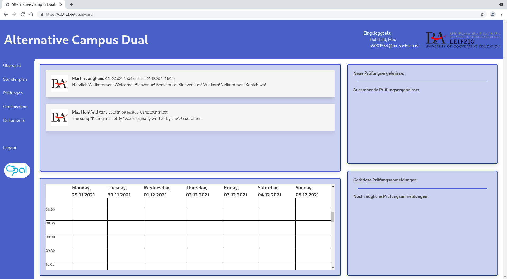

# Softwareprojekt Campus Dual Alternative

## Preview

## Demo
This code is live at [https://cd.tfld.de](https://cd.tfld.de).

## Structure
- doc: project specific documentation
- src: source code
	- campusdual: main project app, where all other apps are linked together
		- settings.py: project config lives here
	- cd_core: main app, where code goes that doesnt fit in other apps
	- cd_dashboard: shows a nice overview containing data from all other apps
	- cd_documents: generate documents like Immatrikulationsbescheinung
	- cd_examination: everything examination related
	- cd_organisation: some general information about studies
	- cd_timetable: schedule app
	- django_explorer: simple html filebrowser adapted from [django-explorer](https://github.com/dhvcc/django-explorer)
	- manage.py: script to control the django app, e.g. runserver, dbshell, migrations...
	- requirements.txt: dependencies which are required for the app to run
	- static: static files like stylesheets, pictures or scripts
	- templates: html templates go here

## Get started
1. Install `python python-virtualenv python-pip` (package names come from Arch Linux; Python 3.9 required).
2. Clone this git repository.
3. Create and activate an python virtual environment.
4. Run `pip install -r src/requirements.txt` to install dependencies.
5. Edit `src/campusdual/settings.py` to change settings like database, email delivery or security. No changes needed if you are developing.
6. Run `python src/manage.py migrate` to setup database scheme.
7. Run `python src/manage.py createsuperuser` to create an admin account for logging in.
8. Run `python src/manage.py runserver` to start the django server (only for development!).

## Warning
Django-explorer requires an unix directory at `/mnt/info` otherwise the server wont start / crash, so developing that portion of code can only be done on a unix system. To start developing the other components on Windows, locally-delete the directory `src/django-explorer`, comment out the corresponding path in `src/campusdual/urls.py` and remove the app in `src/campusdual/settings.py`.  

The app was developed using the web browsers Chrome/Chromium and Firefox, so the app may not work or look odd in other/older web browsers.  

## License & copyright
© Martin Junghans & Max Hohlfeld  
The code in this repository is licensed under the [GNU AGPL v3](https://www.gnu.org/licenses/agpl-3.0.html) license.  
